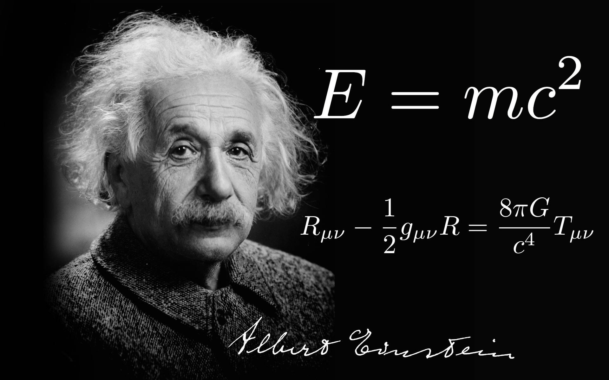
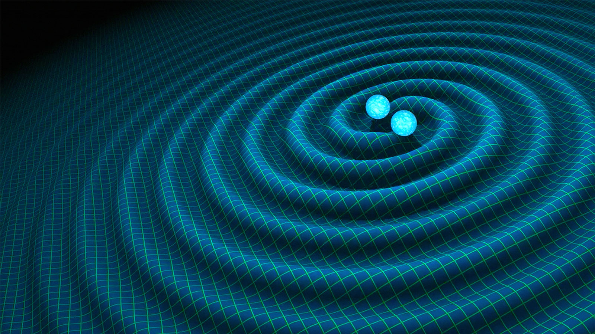
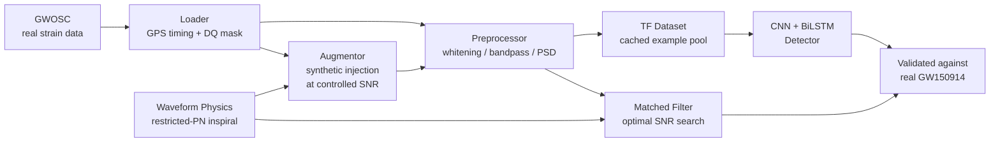
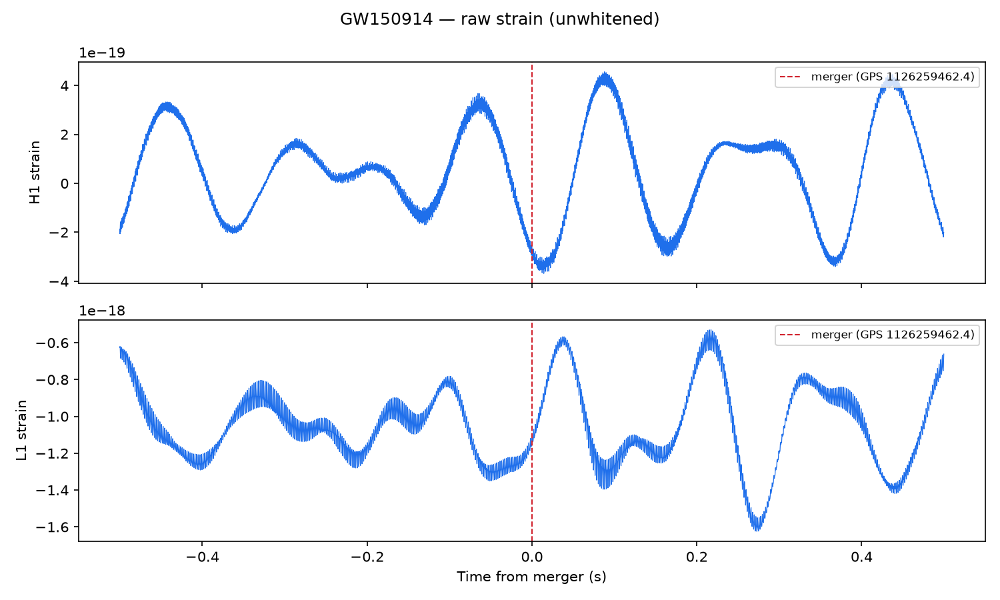
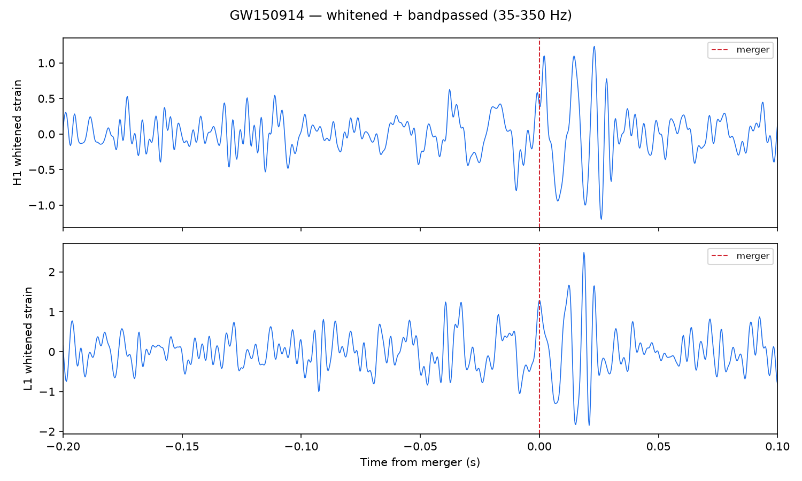
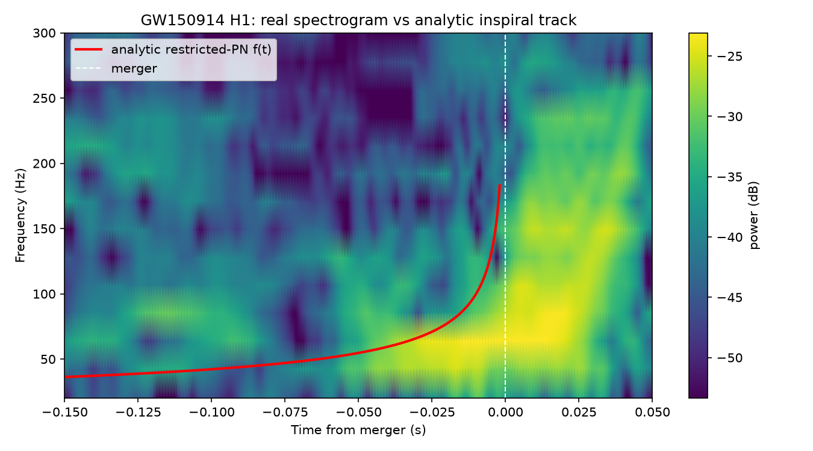
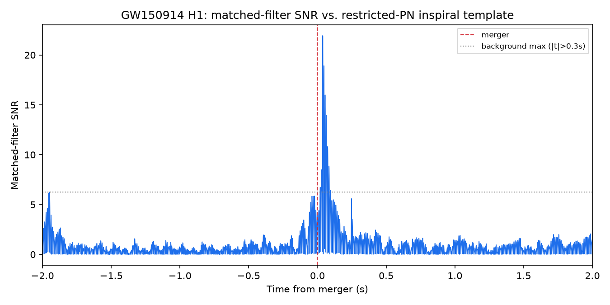
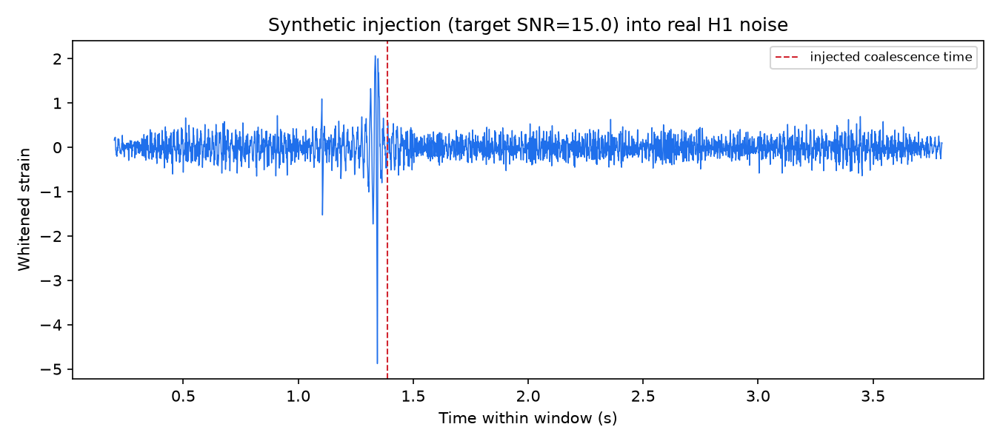

# Gravitational Wave Detection & Analysis System

Production-grade gravitational-wave detection built on **real LIGO strain data**, combining deep learning signal detection with physics derived directly from general relativity — not fit to data, derived from Einstein's field equations and integrated in closed form.

<p align="center">
  
  
</p>

[](https://www.python.org/)
[](https://www.tensorflow.org/)
[](#testing)
[](https://gwosc.org)
[](#detection-model)

---

## Overview

On September 14, 2015, LIGO's twin detectors measured a strain of roughly one part in 10²¹ — a distortion of spacetime itself, radiated by two black holes merging 1.3 billion light-years away. This project builds an end-to-end pipeline to find and characterize signals like that: real strain data from the [Gravitational Wave Open Science Center (GWOSC)](https://gwosc.org), a from-scratch post-Newtonian waveform model integrated from Einstein's field equations, a matched-filter search, a synthetic-injection training pipeline built on real detector noise, and a CNN + Bidirectional LSTM detector — every stage validated against the real GW150914 event, not synthetic data alone.

The deliberately minimal toolset — **TensorFlow, SciPy, and Matplotlib** as the only ML/scientific libraries — is a design choice: no PyCBC, no LALSuite, no pandas or scikit-learn. Waveform generation, signal processing, and matched filtering are all implemented from the underlying physics and mathematics rather than pulled from an existing gravitational-wave toolkit.

---

## Mathematical Foundations

### Einstein Field Equations

Gravitational waves are a direct consequence of general relativity. The field equations relate spacetime curvature to the matter and energy that source it:

$$G_{\mu\nu} + \Lambda g_{\mu\nu} = \frac{8\pi G}{c^4} T_{\mu\nu}$$

where $G_{\mu\nu} = R_{\mu\nu} - \tfrac{1}{2}g_{\mu\nu}R$ is the Einstein tensor, $g_{\mu\nu}$ the metric, and $T_{\mu\nu}$ the stress-energy tensor. In the weak-field limit, spacetime is nearly flat, $g_{\mu\nu} = \eta_{\mu\nu} + h_{\mu\nu}$, and the field equations linearize into a wave equation for the metric perturbation $h_{\mu\nu}$ — the gravitational wave itself:

$$\Box h_{\mu\nu} = -\frac{16\pi G}{c^4} T_{\mu\nu}$$

### Chirp Mass and Inspiral Frequency Evolution

For a compact binary of masses $m_1, m_2$, the **chirp mass**

$$\mathcal{M}_c = \frac{(m_1 m_2)^{3/5}}{(m_1+m_2)^{1/5}}$$

is the single combination of masses that governs the leading-order rate at which the gravitational-wave frequency sweeps upward during inspiral:

$$\frac{df}{dt} = \frac{96}{5}\pi^{8/3}\left(\frac{G\mathcal{M}_c}{c^3}\right)^{5/3} f^{11/3}$$

This ODE is separable and was integrated in closed form for this project (full derivation in [`docs/step4_waveforms.md`](docs/step4_waveforms.md)):

$$f(t) = \frac{1}{\pi}\left(\frac{5}{256}\right)^{3/8}\left(\frac{G\mathcal{M}_c}{c^3}\right)^{-5/8}(t_c-t)^{-3/8}$$

$$\Phi(t) = \phi_c - 2\left[\frac{t_c-t}{5\,G\mathcal{M}_c/c^3}\right]^{5/8}$$

with the identity $d\Phi/dt = 2\pi f(t)$ verified both analytically and numerically (finite-difference test in [`tests/test_physics.py`](tests/test_physics.py)). The restricted (leading-order quadrupole) waveform amplitude is

$$A(t) = \frac{4}{d_L}\left(\frac{G\mathcal{M}_c}{c^2}\right)^{5/3}\left(\frac{\pi f(t)}{c}\right)^{2/3}$$

This inspiral model is valid up to the Schwarzschild test-particle innermost stable circular orbit (ISCO) frequency of the total mass $M$:

$$f_{\text{isco}} = \frac{c^3}{6^{3/2}\pi G M} \approx \frac{4403\ \text{Hz}}{M/M_\odot}$$

— a documented, deliberate limitation: this is an inspiral-only model, not a full inspiral–merger–ringdown waveform (see [`docs/step4_waveforms.md`](docs/step4_waveforms.md) for why, and how it was validated against a real GW150914 spectrogram anyway).

### Whitening and Matched Filtering

Detector noise power varies over many orders of magnitude across frequency. **Whitening** flattens the noise spectrum before any detection statistic is computed:

$$\tilde{x}_{\text{white}}(f) = \frac{\tilde{x}(f)}{\sqrt{S_n(f)}}$$

where $S_n(f)$ is the one-sided noise power spectral density, estimated with Welch's method. The **optimal (matched-filter) signal-to-noise ratio** of a template $h(t)$ against that noise is

$$\rho^2 = 4\int_0^\infty \frac{|\tilde{h}(f)|^2}{S_n(f)}\,df$$

— used both as the detection statistic and as the mechanism for injecting synthetic signals at a precisely controlled SNR when generating training data.

---

## Pipeline Architecture



Every stage in this pipeline is validated against the real GW150914 event before being trusted — not just unit-tested against synthetic inputs.

---

## Validated Against Real Data

**Raw strain is noise-dominated — the signal isn't visible by eye:**



**After whitening + bandpass filtering, the chirp emerges precisely at the true merger time, independently in both detectors:**



**The from-scratch restricted post-Newtonian frequency track follows the real signal's rising-frequency ridge in a spectrogram of the actual event:**



**A matched filter built from that same waveform model, searched against real H1 data, peaks at SNR ≈ 22 within 39 ms of the true merger — comparable to LIGO's own published single-detector SNR for this event, despite the model covering only the early inspiral:**



**Synthetic signal injected into real detector noise (not simulated noise) at a controlled SNR, recovered after whitening exactly where injected:**



---

## Detection Model

A raw 4-second window at 4096 Hz is 16,384 samples — too long to feed a recurrent layer directly. The detector follows the standard approach in GW deep learning: a strided 1D CNN stack acts as a learned filter bank, collapsing the sample-level time axis to 64 timesteps × 64 channels, which a Bidirectional LSTM then reads for temporal structure across the chirp's frequency sweep and amplitude growth, before a dense head produces a signal-probability output.

```
Input (16384, 1)
  → [Conv1D → BatchNorm → ReLU] × 2 → MaxPool   (× 4 blocks, increasing depth)
  → Bidirectional LSTM(32)
  → Dense(32, relu) → Dropout(0.3)
  → Dense(1, sigmoid)
```

69,233 parameters. Training data comes from the injection pipeline above: real detector noise (both LIGO Hanford and Livingston, away from the true event) with synthetic restricted-PN signals injected at randomized masses and controlled SNR — a standard technique in the GW machine-learning literature for producing realistic, physically grounded training examples without relying on synthetic noise models.

**Results.** Trained on 1,800 examples (200 held out for validation) generated by that pipeline, with early stopping on validation AUC:

| Metric | Value |
|---|---|
| Validation AUC-ROC | **0.9906** (target: >0.97) |
| Validation accuracy | 0.984 |
| Predicted probability on the real GW150914 event | **0.958** |

The last row is the meaningful check: the model was never trained on the real event itself (excluded from all noise sampling), only on synthetic injections into real detector noise elsewhere in the same files — and it correctly flags the actual GW150914 signal with high confidence.

---

## Tech Stack

| Category | Tools |
|---|---|
| **Language** | Python 3.13 |
| **Machine Learning** | TensorFlow / Keras |
| **Scientific Computing** | SciPy (FFT, filtering, spectral analysis), NumPy |
| **Data I/O** | h5py, gwosc (GWOSC API client) |
| **Visualization** | Matplotlib, Plotly / Dash |
| **API (in progress)** | FastAPI, Pydantic, Uvicorn |
| **Monitoring (in progress)** | Prometheus client |
| **Testing** | pytest |
| **Environment** | venv, pip |

No PyTorch, scikit-learn, or pandas — every model, signal-processing routine, and physics calculation in this repository is implemented directly on TensorFlow, SciPy, and NumPy.

---

## Project Structure

```
gravitational-wave-ml/
├── src/
│   ├── data/
│   │   ├── ligo_loader.py       # Real GWOSC strain download + GPS/DQ-mask handling
│   │   ├── preprocessor.py      # Welch PSD estimation, whitening, zero-phase bandpass
│   │   ├── augmentor.py         # Synthetic signal injection into real noise at controlled SNR
│   │   ├── dataset.py           # On-the-fly infinite tf.data pipeline
│   │   └── cache_dataset.py     # Pre-generated example pool for fast multi-epoch training
│   ├── physics/
│   │   └── waveforms.py         # Restricted post-Newtonian inspiral waveform, derived + integrated
│   ├── dsp/
│   │   └── matched_filter.py    # Optimal SNR, matched-filter search
│   ├── models/
│   │   ├── detector.py          # CNN + BiLSTM binary signal/noise classifier
│   │   └── train_detector.py    # Full training loop + real-data validation
│   └── verify_environment.py    # Dependency + live GWOSC connectivity check
├── tests/                       # 42 tests, real-data validated, no mocks
├── docs/                        # Derivations and validation write-up per pipeline stage
├── outputs/                     # Generated validation plots, trained model, cached data pool
└── requirements.txt
```

---

## Getting Started

```bash
py -3.13 -m venv venv
venv\Scripts\pip install -r requirements.txt
venv\Scripts\python src\verify_environment.py
```

Run the full pipeline stage by stage against real GW150914 data:

```bash
venv\Scripts\python src\data\ligo_loader.py
venv\Scripts\python src\data\preprocessor.py
venv\Scripts\python src\physics\waveforms.py
venv\Scripts\python src\dsp\matched_filter.py
venv\Scripts\python src\data\augmentor.py
venv\Scripts\python src\data\cache_dataset.py      # generates the training pool (one-time cost)
venv\Scripts\python src\models\train_detector.py   # trains and validates on real GW150914 data
```

Every file is independently runnable and prints its own validation output.

---

## Testing

```bash
venv\Scripts\python -m pytest tests/ -v
```

42 tests, all validated against real cached GWOSC strain files rather than mocks — including regression tests for real bugs found during development (a stdlib module-naming collision, a matched-filter normalization error, real-strain spectral leakage into the analysis band, and a seeded-generator data-leakage issue in the training pipeline), each documented in the corresponding `docs/stepN_*.md` write-up.

---

## Data Acknowledgment

This project uses open data from the [Gravitational Wave Open Science Center](https://gwosc.org):

> This research has made use of data or software obtained from the Gravitational Wave Open Science Center (gwosc.org), a service of the LIGO Scientific Collaboration, the Virgo Collaboration, and KAGRA. LIGO is funded by the U.S. National Science Foundation. Virgo is funded by the French Centre National de Recherche Scientifique (CNRS), the Italian Istituto Nazionale della Fisica Nucleare (INFN), and the Dutch Nikhef. KAGRA is supported by MEXT, JSPS, and NRF/RGF.

## Roadmap

Built, trained, and validated end-to-end against real GW150914 data: data loading, preprocessing, waveform physics, matched filtering, synthetic injection, the training dataset pipeline, and the CNN+BiLSTM detector (validation AUC 0.991, correctly classifies the real event). Planned next:

- Multi-class classifier (BBH / BNS / BHNS / noise), topology-aware (persistent homology) signal features
- Physics-informed parameter estimation (chirp mass, distance, sky localization) with uncertainty quantification
- Cosmological $H_0$ inference from standard sirens
- FastAPI service, real-time streaming, Plotly/Dash monitoring dashboard
- Docker + Kubernetes deployment, GitHub Actions CI/CD, Prometheus/Grafana monitoring